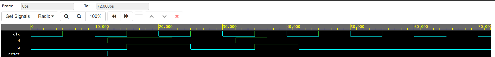

# D-Flip-Flop--Verilog
Positive edge-triggered D Flip-Flop in Verilog with asynchronous reset and testbench
# D-Flip-Flop--Verilog

Positive edge-triggered D Flip-Flop in Verilog with asynchronous active-high reset and testbench.

## 🔌 D Flip-Flop Circuit Diagram
D-flip-flop-circuit
**Working:** D Flip-Flop using 7400 quad 2-input NAND gates. Master-Slave configuration.

## ⚡ Truth Table
| CLOCK | RESET | D | Q(next) |
| --- | --- | --- | --- |
| x | 1 | x | 0 |
| ↑ | 0 | 0 | 0 |
| ↑ | 0 | 1 | 1 |
| No ↑ | 0 | x | Q(prev) |

`↑` = positive edge

## 📈 Simulation Waveform

Output `Q` follows input `D` only at positive clock edge.

## 📁 Files
- `dff.v` : RTL code
- `tb_dff.v` : Testbench
- `waveform.png` : Simulation output

## ✅ Verified On
EDA Playground using Icarus Verilog 12.0

**Author:** Pavithra | ECE 4th Year
